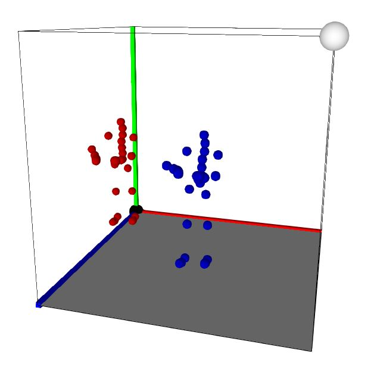
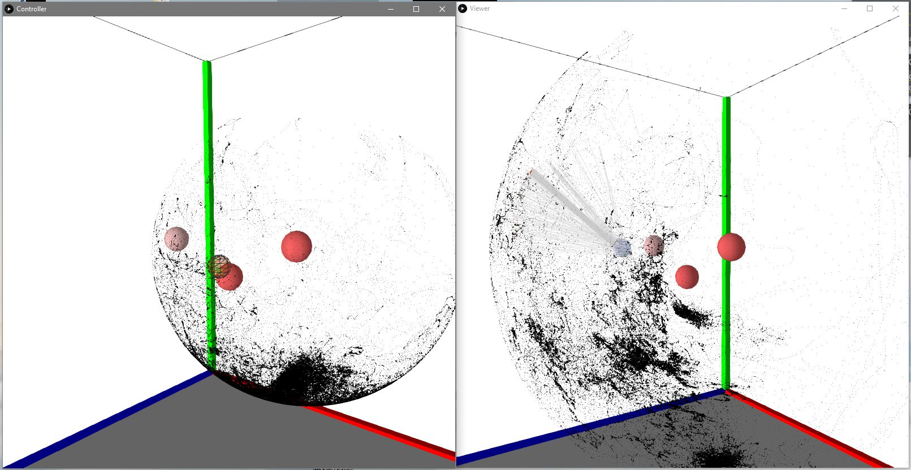

## If you only know where your head and hands are, where are your elbows?

During my senior year of college, I undertook an undergraduate thesis project to answer this question. Or, more accurately, whether a neural network can outperform existing solutions like inverse kinematics.

### Context

Virtual Reality is a rapidly growing technology. While most applications manifest the user simply as a pair of floating hands, some applications try to recreate the user's entire body. But if the user's eyes tell them that their arms are in a different location than where they [_know_](https://en.wikipedia.org/wiki/Proprioception) they are, the user will feel uncomfortable.

Existing solutions generally use some form of inverse kinematics to solve where the user's elbow is located. It works, but it's better for procedural animations or robotic arms than it is for recreating a person's real arm.

So, the current best solution to the problem is one that isn't good enough to be widely used.

### Tools

This project used:

- Python, for making the data processor
- Jupyter Notebooks, for writing and running the models
- Keras, for building the models
- Java & Processing, for making the visualizations
- Git/GitHub, for version control

The original data was sourced from the [Carnegie Mellon University Graphics Lab Motion Capture Database](http://mocap.cs.cmu.edu/).

### Work

Between August 2019 and May 2020, my work was overseen by faculty advisor Dr. Katherine Schroeder, whose assistance, insight, and encouragement were invaluable.

Over the course of the year, I built an overly complex data processor, a visualization tool to check if my processor worked, and a second visualization tool to see whether I had gaps in my data or to uncover any unknown patterns in the data.

#### Data Processor Verification Tool

This tool simultaneously plays the unprocessed and processed motion capture data. This allows us to compare the two versions of the motion captures and to verify that the processor correctly normalized the data.

#### Coverage Visualization Tool

This visualization tool allows me to see the relevant training data, and to understand the relationship between elbow location and hand location. The visualization tool has two parts. The left window is the Controller Window, and the right is the Viewer Window. The Controller Window allows for the selection (via manual control of the wireframe sphere) of a subset of elbow locations, then in the Viewer Window, the related hand locations are indicated. A joint is represented by a single black point, and the orange spheres are reference points for the shoulders and chest.

We can see in the visualization that there are distinct regions of low and high sampling. This helped inform me of potential issues with the dataset that I was using. Eventually, I would go on to collect my own data, taking care to ensure even sampling.

### Results & Future Work

Well... my results weren't great. In fact, you would be better off randomly guessing where the elbow is than using even my most accurate neural network model.

So that's not too great, is it? I learned a lot along the way, but not exactly I was expecting. I plan on effectively heading back to the drawing board and reworking my process to try to get better results.

---
